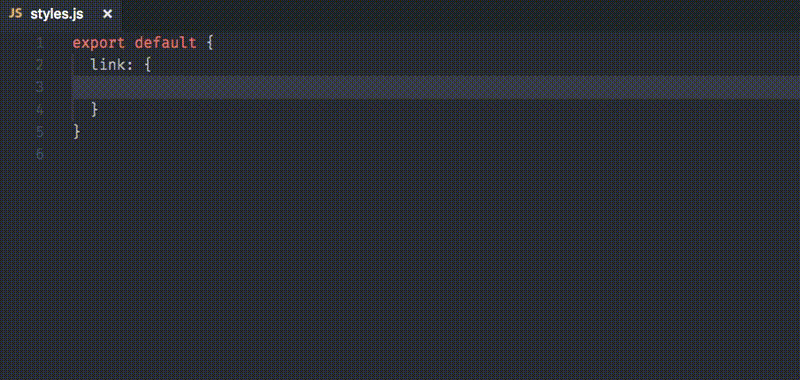

# JSS snippets for VS Code

[JSS](http://cssinjs.org/) Emmet like snippets for Visual Studio Code in JavaScript file.

✨ Using with any library that accepts style as JavaScript object is OK. like styled-components, aphrodite, glamor, glamorous and more.

## Usage

All snippets start with `j` prefix.

## Installation

Go to Extensions panel (⇧⌘X) then search `JSS snippets` and install.

#### For more information

- Reference: [Emmet cheat sheet](https://docs.emmet.io/cheat-sheet/)
- Source: [Github](https://github.com/visioncan/vscode-jss-snippets)

**Enjoy! ☕️**
